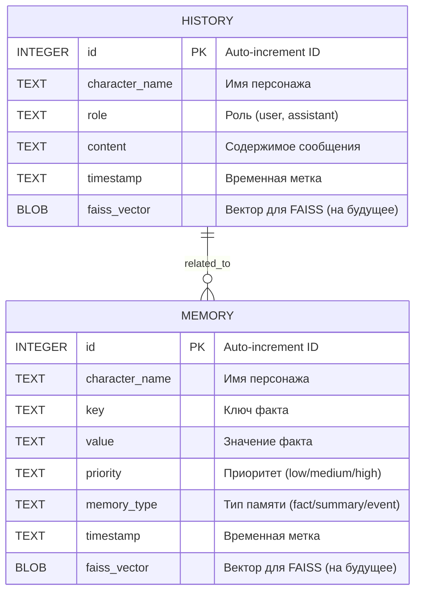

# Схема базы данных NeuroMita

## Описание
База данных `neuromita.db` использует SQLite для централизованного хранения истории чатов и памяти персонажей. Это заменяет предыдущую JSON-структуру в директориях `Histories/{character}/`.

Две основные таблицы:
- **history**: Хранит сообщения чатов для каждого персонажа.
- **memory**: Хранит факты и воспоминания для каждого персонажа.

Поля `faiss_vector` (BLOB) подготовлены для будущей интеграции с FAISS для векторного поиска.

## Mermaid ER-диаграмма



## SQL-схема (для справки)
```sql
CREATE TABLE IF NOT EXISTS history (
    id INTEGER PRIMARY KEY AUTOINCREMENT,
    character_name TEXT NOT NULL,
    role TEXT NOT NULL,
    content TEXT NOT NULL,
    timestamp TEXT NOT NULL,
    faiss_vector BLOB
);

CREATE TABLE IF NOT EXISTS memory (
    id INTEGER PRIMARY KEY AUTOINCREMENT,
    character_name TEXT NOT NULL,
    key TEXT NOT NULL,
    value TEXT NOT NULL,
    priority TEXT DEFAULT 'medium',
    memory_type TEXT DEFAULT 'fact',
    timestamp TEXT NOT NULL,
    faiss_vector BLOB
);
```

Эта схема обеспечивает совместимость с существующими моделями: `HistoryManager` и `MemoryManager` будут фасадами над `DatabaseManager`, возвращая данные в формате, аналогичном JSON (списки словарей).